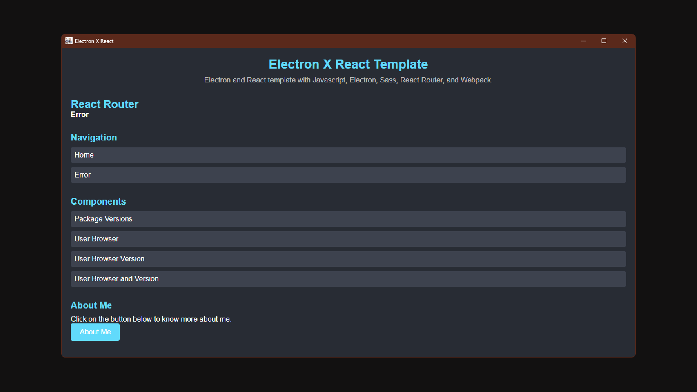

# Electron x React

**Electron x React** is an Electron-based app template that allows you to create desktop applications using ReactJS for the frontend, SCSS or CSS, and Node.js. This template enables you to develop without relying on Create-React-App and provides a simple way to build and package your application for multiple platforms.

### Preview

## Features
* ReactJS integration for frontend development
* SCSS and CSS support
* Latest Node.js and ElectronJS versions
* Live reloading during development
* Secure interactions with Node.js and other packages
* Automatic packaging for Windows, Linux, and macO

## Getting Started

### Prerequisites
* Node.js (preferably version 20.0.0)
* PNPM (optional, for faster package management)

### Installation
1. Clone this repository.
2. Install all the dependencies by running `npm install` or `pnpm install`.

### Running the App
* For production mode, run `npm start` or `pnpm run start`.
* For development mode, run `npm run dev` or `pnpm run start dev`.

## Configuration
The only configuration files you may need to customize are the `package.json` file for the app name and app id, and the `public/index.html` file for the display name.

## Development Process
* Develop the Electron app as you normally would, using ReactJS instead of plain HTML and JS.
* We recommend using Visual Studio Code as the IDE and backing up your work with a version control system (like GitHub or GitLab).

## Preloader and Live Reloading
* The Electron preloader file is used to preload content.
* Live reloading is enabled using a local live server running on a specific port that no other service uses, and displaying it directly in the app.

## Security
* Context isolation and the preloader are used to ensure secure interactions with Node.js and other packages.
* Remember to double-check the utility of a code, clean up after yourself, and follow other best practices as needed.

## Building and Packaging
* To build the app for production, run `npm run package` or `pnpm run package`. This uses the electron-builder function.
* The app is automatically packaged for Windows, Linux, and macOS.

## Troubleshooting
* If you encounter any issues, please seek help or report them on the [GitHub issues](https://github.com/TheNolle/Electron-x-React/issues) page or join the [Discord server](https://discord.com/invite/86yVsMVN9z).

## Contributing
* To contribute to the project, create an issue, submit a pull request, or contact the maintainer on the [Discord server](https://discord.com/invite/86yVsMVN9z).
* When contributing, avoid using semicolons, use apostrophes instead of quotation marks, and make the code easy to read. Don't forget to comment as if the reader is new to JavaScript, ReactJS, Node.js, ElectronJS, etc.

## License
This project is licensed under a [custom MIT license](LICENSE) approved by the maintainer's lawyer. The license protects the maintainer from theft and requires users to credit the maintainer if they use the code.
